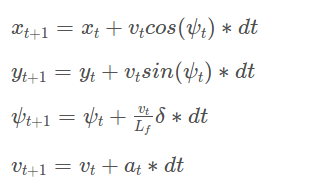
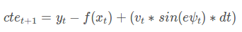
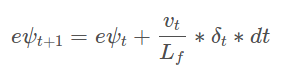

# CarND-Controls-MPC

As pre the review rubric, this document describes the solution to this project.  I submitted this project very late, frankly, because I was having too much fun. 

### Model: 

Since the Unity physics engine behind the simulator is likely to be idealized, I assumed that the effort of exploring a dynamic model to incorporate tire physics, aero, etc was not worth it.  Also, models of similar complexity are in production ADAS solutions on vehicles today. 

The model for the MPC controller uses the kinematic model equations shown below to define the state. 



Cross track error and orientation error are calculated using the equations below.





Those 6 terms define the state used in the model.</br>
**x,y	:**  	current vehicle position incartesian coordinates, meters</br>
**psi	:** 	orientation angle of vehicle in coordinate frame, radians</br>
**v	:** 	longitudinal velocity, meters per second</br>
**cte	:** 	cross-track error, meters</br>
**epsi	:** 	orientation error, radians</br>

Actuator terms, delta and a, represent the steering angle and acceleration values for the model. </br>
**delta:** 	steering angle, radians</br>
**a	:** 	acceleration, meters per second^2</br>

The term Lf defines the characteristic length of the vehicle used to compute the change in orientation from steering angle. 

### Prediction Count and Timestep Duration:

During early iterations of the project, predictions were run to 0.8 seconds with 0.1 second time steps. (N=8). I chose this low number because early iterations of the model had strange fits that did not correctly fit the functions. With a lower number of points to fit, there was more consistent performance. As I fixed various implementation errors and tuned the cost gains for the optimizer, I found that I was not able to project far enough into the future to accomodate curves at the end of the high speed straights. 

Increasing N to 11 allowed for a slightly longer projection into the future. I also decided to increase the dt value to reflect what the timing between iterations was. When checking the velocity to calculate acceleration values for actuator characterization, step times (including the latency) were seen at roughly 115-135ms.  Adjusting dt to 0.12s allowed for a closer alignment with these values.  With these new values there was a more controlled entry and exit to corners when approaching at high speed.

### Polynomial Fitting:

To fit to the track waypoints, a coordinate transformation is done based on the vehicle position returned from the simulator.

```c++
for(int i = 0; i < ptsx.size();i++){
	double shift_x=ptsx[i]-px;
    double shift_y=ptsy[i]-py;
	vref_path_x[i]=(shift_x*cos(0-psi)-(shift_y)*sin(0-psi));
	vref_path_y[i]=(shift_x*sin(0-psi)+(shift_y)*cos(0-psi));
	}
```

Doing this coordinate transformation resets the position of the vehicle to (0,0) and the heading angle psi to 0. In this new coordinate frame, the waypoints are fit to a 3rd order polynomia using polyfit.  With our new coordinate frame, computing errors and reference states is simplified as most terms the reference state (t=0) are equal to zero. 

```c++
double x0 = 0;
double y0 = 0;
double psi0 = 0;
double v0 = v*0.44704;  		// Converts mph to m/s
double cte0 = coeffs[0]; 		// 0 order term of polynomial fit
double epsi0 = -atan(coeffs[1]);// psi error is psi - the arc tangent of the first derivative of the line function 
```

Code comments in main.cpp describe all of the simplification that the zero-value terms bring for the t=1 case for latency correction.  The resulting state is provided below.  Note that the calculation for epsi1 is simplified by avoiding duplicate calculation and directly referencing psi1. 

```c++
double x1 = v0 * dt; 
double y1 = 0;
double psi1 = (v0 * delta0 * dt / Lf);
double v1 = v0 + a0 * dt
double cte1 = cte0 + (v0 * sin(epsi0) * dt);
double epsi1 = -atan(coeffs[1]) + psi1;
```


### Actuator Accomodation:

As described in the project notes, the steering values returned from the simulator are provided in radians but steering angle is requested by providing a value of -1 to 1. This is scaled by the radian equivalent of 25 degrees.  The sign of the value is also opposite the model coordinates so a -1 is mutilpied on the values returned and sent to allow the model equations to remain unchanged. 

The acceleration term was given special accomodations due to the fact that the simulator accepts a -1 to 1 throttle value and it does not adequately represent the response the vehicle. By measuring the response of the vehicle to full throttle over the course of a second a rough estimate of full throttle acceleration was calculated to be between 6 and 5 m/s^2 at low speeds.  This was done by displaying the speed and time at each update. 

Inside the repository for the Unity simulator there is a vehicle with a full torque output of 2500Nm and a mass of 1000kg. When accounting for wheel radius (0.37m), the proper conversion from throttle to acceleration is defined. 

```c++
double a0 = thrtl0*(2500/0.37)/1000;
```

The inverse of this is used to calculate the throttle value sent to the simulator from the acceleration value returned by the model. 

```c++
double throttle_value = out.A[0]*1000/(2500/0.37);
```

This extra step was deemed to be necessary after converting the speed units returned from mph to m/s.  Position is reported back from the simulator are in meters so this was done to make the model units align.  

The vehicle parameters that matched the measured acceleration also had a drag factor of 0.1.  Since I was trying to get the car around the track as aggressively as possible, I decided to include this as its effect increases as you increase speed. Per an explanation on the Unity forums (https://forum.unity.com/threads/drag-factor-what-is-it.85504/), accounting for drag leads to the following calculation for v(t+1).

```c++
// Base Equation: v1 = (v0 + a0 * dt)
// Adding drag term to v1 calculation
double v1 = (v0 + a0 * dt) * (1 - drag*dt);
```

###Model Predictive Control 

Using the state equations provided above, and the Ipopt optimization package included with the project repo, an MPC controller was implemented to define actuator outputs to drive the vehicle around the track. 

####Latency Compensation

To compensate with the required 100ms control latency, an external iteration of the model is calculated using actuator values reported back from the simulator. The state is predicted forward in time using the simplified state equation code provided earlier. This predicts the state the car will be in when the actuation commands are executed. This creates a high probability that terms from the state prediction will accurate and relevant by the time they are received. 

####Cost Functions for Path Optimization

The base set of cost equations from the MPC Quizzes will provide a safe, stable control of the vehicle up to a certain certain speed. At that point, the ideal line described by the waypoints will hold back lap times and max speed. Since this is just a simulator with no consequences, that allows us to have some fun while getting a better understanding of each of the cost functions. The following sections describe the cost functions I used to influence the vehicle toward more of a 'racing line.' 

######CTE and Orientation Error

To provide the vehicle some freedom to cut the corners and avoid taking too far outside of a line, I decided to use the incremented variable, t, in the cost function to bias influence toward the end of that predicted path. Adding a 1 ensured that the reference state still had influence. 

```c++
for (int t = 0; t < int(N); t++) {
	fg[0] += ((t+1)/N)*20*CppAD::pow(vars[cte_start + t], 2);
    fg[0] += ((t+1)/N)*20*CppAD::pow(vars[epsi_start + t], 2); 
    }
```

#######Velocity (No Changes)
To allow for dynamic control of the velocity based on steering, only a light weight was put on velocity. Since it was a numerically larger value, a weight of 0.1 was adequate. This was verified by viewing the throttle values of 1 printed to the terminal. 

#######Actuators, Magnitude (No Changes)
To ensure smooth paths were taken, a large penalty was placed on high steering angles. Conversely, a small penalty was placed on large throttle values. 

```c++
    for (int t = 0; t < int(N) - 1; t++) {
      fg[0] += 900*CppAD::pow(vars[delta_start + t], 2);
      fg[0] += 0.1*CppAD::pow(vars[a_start + t], 2); 
    }
```

#######Actuators, Incremental Change (No Changes)
Again, to ensure smooth, consistent paths large penalty was placed to large changes in steering angle. 

```
   for (int t = 0; t < int(N) - 2; t++) {
      fg[0] += 35000*CppAD::pow(vars[delta_start + t + 1] - vars[delta_start + t], 2);
      fg[0] += 0.1*CppAD::pow(vars[a_start + t + 1] - vars[a_start + t], 2);
    }
```

#######Speed Based on Steering Input a.k.a. Braking Into Hard Corners 
I want to accelerate or slow the vehicle based on the future steering angle values to allow the vehicle to hold the line without error. I also don't want to heavily penalize the current steering angle in the event that the vehicle is at corner exit.

To achieve this, a penalty is accumulated by multiplying the velocity at t+1 (the only output state used) by the steering angle at all other predicted states.

```c++
for (int t = 0; t < int(N) - 1; t++) {
     fg[0] += 18*CppAD::pow((vars[v_start+1]*vars[delta_start+t]),2);     
    };
``` 

######Euclidean Distance 
In order to stabilize the paths taken and push those paths toward the inside lines during long sweeping turns, a Euclidean distance constraint was added to the system as well. This is likely the least important cost function relative to the others and a deeper mathematical analysis might show that this may not be needed.  


## Original Udacity Content Below


Self-Driving Car Engineer Nanodegree Program

---

## Dependencies

* cmake >= 3.5
 * All OSes: [click here for installation instructions](https://cmake.org/install/)
* make >= 4.1(mac, linux), 3.81(Windows)
  * Linux: make is installed by default on most Linux distros
  * Mac: [install Xcode command line tools to get make](https://developer.apple.com/xcode/features/)
  * Windows: [Click here for installation instructions](http://gnuwin32.sourceforge.net/packages/make.htm)
* gcc/g++ >= 5.4
  * Linux: gcc / g++ is installed by default on most Linux distros
  * Mac: same deal as make - [install Xcode command line tools]((https://developer.apple.com/xcode/features/)
  * Windows: recommend using [MinGW](http://www.mingw.org/)
* [uWebSockets](https://github.com/uWebSockets/uWebSockets)
  * Run either `install-mac.sh` or `install-ubuntu.sh`.
  * If you install from source, checkout to commit `e94b6e1`, i.e.
    ```
    git clone https://github.com/uWebSockets/uWebSockets
    cd uWebSockets
    git checkout e94b6e1
    ```
    Some function signatures have changed in v0.14.x. See [this PR](https://github.com/udacity/CarND-MPC-Project/pull/3) for more details.

* **Ipopt and CppAD:** Please refer to [this document](https://github.com/udacity/CarND-MPC-Project/blob/master/install_Ipopt_CppAD.md) for installation instructions.
* [Eigen](http://eigen.tuxfamily.org/index.php?title=Main_Page). This is already part of the repo so you shouldn't have to worry about it.
* Simulator. You can download these from the [releases tab](https://github.com/udacity/self-driving-car-sim/releases).
* Not a dependency but read the [DATA.md](./DATA.md) for a description of the data sent back from the simulator.


## Basic Build Instructions

1. Clone this repo.
2. Make a build directory: `mkdir build && cd build`
3. Compile: `cmake .. && make`
4. Run it: `./mpc`.

## Tips

1. It's recommended to test the MPC on basic examples to see if your implementation behaves as desired. One possible example
  is the vehicle starting offset of a straight line (reference). If the MPC implementation is correct, after some number of timesteps
  (not too many) it should find and track the reference line.
2. The `lake_track_waypoints.csv` file has the waypoints of the lake track. You could use this to fit polynomials and points and see of how well your model tracks curve. NOTE: This file might be not completely in sync with the simulator so your solution should NOT depend on it.
3. For visualization this C++ [matplotlib wrapper](https://github.com/lava/matplotlib-cpp) could be helpful.)
4. Tips for setting up your environment are available [here](https://classroom.udacity.com/nanodegrees/nd013/parts/40f38239-66b6-46ec-ae68-03afd8a601c8/modules/0949fca6-b379-42af-a919-ee50aa304e6a/lessons/f758c44c-5e40-4e01-93b5-1a82aa4e044f/concepts/23d376c7-0195-4276-bdf0-e02f1f3c665d)
5. **VM Latency:** Some students have reported differences in behavior using VM's ostensibly a result of latency.  Please let us know if issues arise as a result of a VM environment.

## Editor Settings

We've purposefully kept editor configuration files out of this repo in order to
keep it as simple and environment agnostic as possible. However, we recommend
using the following settings:

* indent using spaces
* set tab width to 2 spaces (keeps the matrices in source code aligned)

## Code Style

Please (do your best to) stick to [Google's C++ style guide](https://google.github.io/styleguide/cppguide.html).

## Project Instructions and Rubric

Note: regardless of the changes you make, your project must be buildable using
cmake and make!

More information is only accessible by people who are already enrolled in Term 2
of CarND. If you are enrolled, see [the project page](https://classroom.udacity.com/nanodegrees/nd013/parts/40f38239-66b6-46ec-ae68-03afd8a601c8/modules/f1820894-8322-4bb3-81aa-b26b3c6dcbaf/lessons/b1ff3be0-c904-438e-aad3-2b5379f0e0c3/concepts/1a2255a0-e23c-44cf-8d41-39b8a3c8264a)
for instructions and the project rubric.

## Hints!

* You don't have to follow this directory structure, but if you do, your work
  will span all of the .cpp files here. Keep an eye out for TODOs.

## Call for IDE Profiles Pull Requests

Help your fellow students!

We decided to create Makefiles with cmake to keep this project as platform
agnostic as possible. Similarly, we omitted IDE profiles in order to we ensure
that students don't feel pressured to use one IDE or another.

However! I'd love to help people get up and running with their IDEs of choice.
If you've created a profile for an IDE that you think other students would
appreciate, we'd love to have you add the requisite profile files and
instructions to ide_profiles/. For example if you wanted to add a VS Code
profile, you'd add:

* /ide_profiles/vscode/.vscode
* /ide_profiles/vscode/README.md

The README should explain what the profile does, how to take advantage of it,
and how to install it.

Frankly, I've never been involved in a project with multiple IDE profiles
before. I believe the best way to handle this would be to keep them out of the
repo root to avoid clutter. My expectation is that most profiles will include
instructions to copy files to a new location to get picked up by the IDE, but
that's just a guess.

One last note here: regardless of the IDE used, every submitted project must
still be compilable with cmake and make./

## How to write a README
A well written README file can enhance your project and portfolio.  Develop your abilities to create professional README files by completing [this free course](https://www.udacity.com/course/writing-readmes--ud777).
